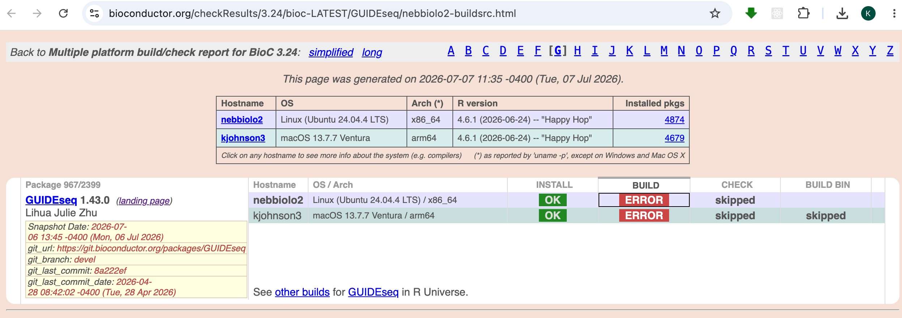
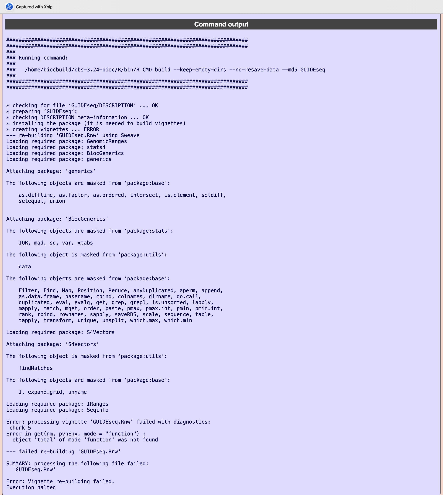

```{r setup, include = FALSE}
knitr::opts_chunk$set(
  collapse = TRUE,
  comment = "#>",
  crop = NULL
)
```

# Introduction

Imagine you are maintaining multiple Bioconductor packages, and one of them fails to build or check on the latest development version of Bioconductor. How would you fix it? The task typically begins with the Bioconductor build report flagging an `ERROR` or `WARNING`, like the one below:



And here is the accompanying error message:



This article walks through a typical workflow: obtaining the package source, recreating the Bioconductor build environment, reproducing the failure, fixing it, and pushing the fix back to Bioconductor.

# Obtain the package source code

If a GitHub repository for the package exists, ask the original developer to add you as a collaborator so you can push changes to the repository directly. Otherwise, you can fork it too. This GitHub repo should be synced with the Bioconductor git repository. Note that Bioconductor runs its own git server at `git.bioconductor.org`, which is separate from GitHub. Typically, developers work on their GitHub repo and push the changes to the Bioconductor git repository during each release cycle.

To pull from and push to the Bioconductor git repository, you need SSH access managed through the [BiocCredentials application](https://git.bioconductor.org/BiocCredentials/), which is independent of your GitHub account. You can verify your access with the following command:
```{bash, eval = FALSE}
ssh -T git@git.bioconductor.org
```

This lists your packages with read (`R`) and write (`W`) permissions. If you need to be added as a maintainer or run into access issues, contact the Bioconductor core team (e.g., Lori Shepherd Kern, Lori.Shepherd@RoswellPark.org).

Once access is set up, you can clone the package source from the Bioconductor
git server:
```{bash, eval = FALSE}
git clone git@git.bioconductor.org:packages/<PackageName>.git
```

The default branch of the Bioconductor git repository is `devel`. You can confirm it with:
```{bash, eval = FALSE}
cd <PackageName>
git branch
```

If you obtained the GitHub repo from the original developer and it is not synced with the Bioconductor git repository, first pull the latest changes from Bioconductor into your local repository. Do this by adding the Bioconductor server as an additional remote:
```{bash, eval = FALSE}
git remote add bioc git@git.bioconductor.org:packages/<PackageName>.git
git pull bioc devel:devel
```

Since pulling from the Bioconductor git repository also requires credentials, once you have the credentials, it is tempting to simply clone and work directly from it, assuming it holds the latest changes. That is not always the case. Before you start, cross-check the GitHub repo against the Bioconductor git repository and merge all commits from both so that your working copy is complete.

# Reproduce the error

Reproducing the error is almost always a matter of recreating the same build/check environment as the Bioconductor build system. You usually cannot reproduce it easily in your local environment, because your local R and Bioconductor versions likely differ from those used by the build system.

Which R version should you target? Package authors should develop against the version of R that will be available when the current Bioconductor `devel` branch becomes the next release. R has a `.y` release (as in `x.y.z`) once a year, typically in mid-April, whereas Bioconductor releases twice a year, in mid-April and mid-October. Consequently, from mid-October through mid-April you should develop against **R-devel**, and from mid-April through mid-October you should develop against **R-release** (since no new R version is imminent). In both cases, use the Bioconductor `devel` version of the packages.

To recreate this environment without disturbing your working R installation, set up a dedicated environment for debugging. The simplest approach is to use the Docker image that the Bioconductor team maintains for exactly this purpose:
```{bash, eval = FALSE}
docker pull bioconductor/bioconductor_docker:devel
```
The `devel` image is updated frequently, so pull a fresh copy whenever you start investigating a new build or check failure.

You can then enter the container from the command line or through the RStudio web interface (browse to `http://localhost:8787`, logging in as user `rstudio` with the password you set):
```{bash, eval = FALSE}
# Command line interface
docker run -it -v /path/to/your/package:/home/rstudio/package bioconductor/bioconductor_docker:devel bash

# RStudio web interface
docker run -e PASSWORD=yourpassword -p 8787:8787 -v /path/to/your/package:/home/rstudio/package bioconductor/bioconductor_docker:devel
```

You can now reproduce the error by running the following command:
```{bash, eval = FALSE}
R CMD build <PackageName>
R CMD INSTALL <PackageName>_<version>.tar.gz
R CMD check <PackageName>_<version>.tar.gz
```

If `R CMD build` fails because dependent R packages are missing, install them first from within R. Make sure you are on the Bioconductor devel repositories:
```{r, eval = FALSE}
BiocManager::install(version = "devel")
BiocManager::install(<MissingPkgName>)
```

If some R packages are not yet available in Bioconductor devel, you can install them manually from their GitHub repositories:
```{r, eval = FALSE}
install.packages("remotes")
remotes::install_github("<username>/<repo>")
```

If system dependencies are missing, you can install them inside the container with `apt-get`, but this requires root privileges. Add `-e ROOT=TRUE` when you start the container to enable `sudo` for the `rstudio` user:
```{bash, eval = FALSE}
docker run -e PASSWORD=yourpassword -e ROOT=TRUE -p 8787:8787 -v /path/to/your/package:/home/rstudio/package bioconductor/bioconductor_docker:devel
```

One common example is `pdflatex`, which is system library required to render the PDF documentation of your package but is often missing. Install it with `apt-get` command:
```{bash, eval = FALSE}
apt-get update && apt-get install -y texlive-latex-base texlive-fonts-recommended texlive-fonts-extra texlive-latex-extra
```

# Save the updated Docker image

Once you have installed all the required dependencies, save the state of the container as a new image so you can reuse it later without repeating the setup. Find the container ID with `docker ps -a`, then commit it:
```{bash, eval = FALSE}
docker commit <container_id> <SnapshotName>:<Version>
```

# Fix the error

Once you can reproduce the error, the next step is to locate the specific line of code responsible. Right after a failure, `traceback()` prints the call stack and often points you to the offending function. To inspect execution interactively, use `debug()` (or `debugonce()`) to step through a function, or set a breakpoint in RStudio. You can also enable `options(error = recover)` to drop into a browser at the point of failure. Finally, agentic coding tools can help you locate and fix the problematic code; while RStudio now ships a built-in AI assistant, I find dedicated tools like Cursor or Claude smoother for this purpose.

# Push the fix to Bioconductor

Before pushing, remember to bump the version in the `DESCRIPTION` file. Bioconductor uses an `x.y.z` scheme in which the devel version has an odd `y`; increment the `z` component (for example, `1.2.3` to `1.2.4`) so the build system picks up your change.

If you obtained the package source directly from the Bioconductor git repository, commit and push to its `devel` branch:
```{bash, eval = FALSE}
git add .
git commit -m "Fix the build error"
git push
```

If you worked from a GitHub repository, push to GitHub first, then push the same commits to the Bioconductor server via a second remote. This keeps the GitHub repo and the Bioconductor git repository in sync:
```{bash, eval = FALSE}
git add .
git commit -m "Fix the build error"
git push origin devel
git remote add bioc git@git.bioconductor.org:packages/<PackageName>.git
git push bioc devel:devel
```
The fix will be reflected in the next Bioconductor build report, which is regenerated daily. Check the build report for your package to confirm the `ERROR`/`WARNING` is resolved.

# Session info {-}

```{r sessionInfo, echo = FALSE}
sessionInfo()
```